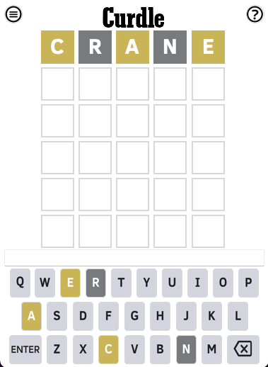

## Welcome to Curdle!

## The app
Honestly, the app is pretty simple. Here's the basic layout. 

## Downloads:
MacOS 64bit: <a href="INSTALLERCurdle-x64.zip">Download Installer</a>  
MacOS 32bit: [Download Installer](https://www.apple.com/shop/buy-mac)  

## MacOS Download Info:
The code is not malware, I promise. Very reassuring, I know. Anyways, after downloading the installer, follow these instructions:

1. Install the app with the .dmg file.
2. Open up Terminal and paste in the following:
    
    xattr -rd com.apple.quarantine /Applications/Curdle.app
    
3. Press enter/return

Then the app should work properly after this step is done. Once again, there is no malware and this is completly secure, I wouln't try and ever distrubute malicious files knowingly.

## Info
Welcome to my *amazing* site for my app Curdle! Curdle is a simple, fun word game thats super lightweight on CPU. Futhermore, COMPLETELY FREE AND OPEN SOURCE!

## Credits
Developed by: Abhay Shukla  
Ok there's probably more to add here but I have no clue so for now pretend is there ;)
